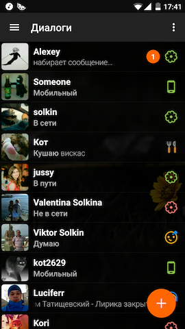
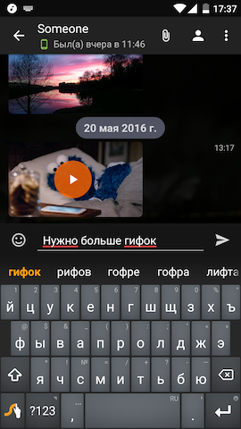
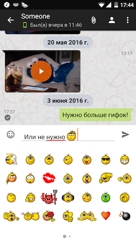
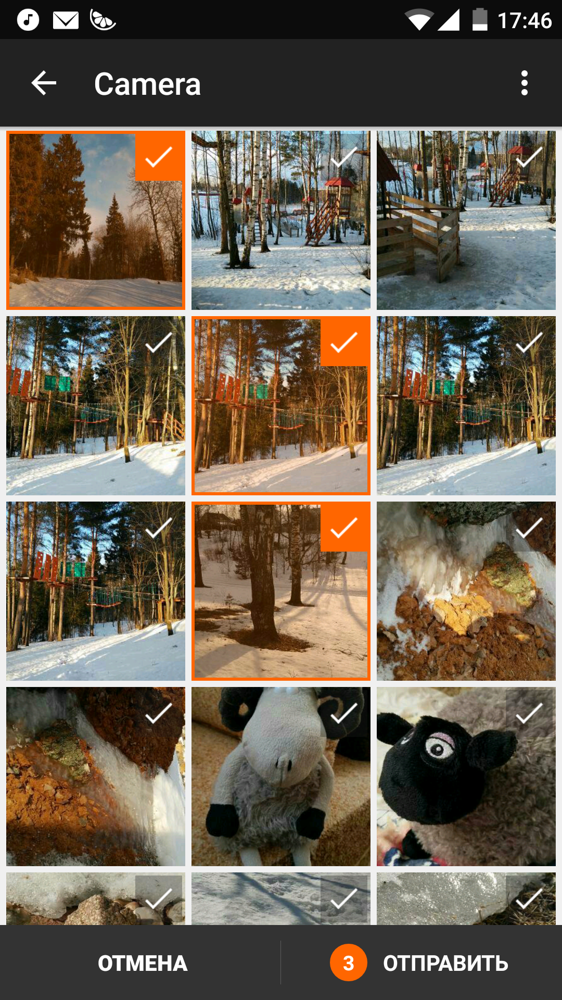

# Mandarin for Android 
Tiny, but powerful Android ICQ client

* Login via UIN/password or phone number.
* Messages, pictures, videos and other files exchange supported.
* Ability to add, edit or remove contacts. 
* Multiaccount support.
* Old-school Kolobok emoticons.
* Lightweight app - APK size is less than 2 MiB.
* Absolutely dark AMOLED theme.
* Ability to edit your account info and upload new avatar.

